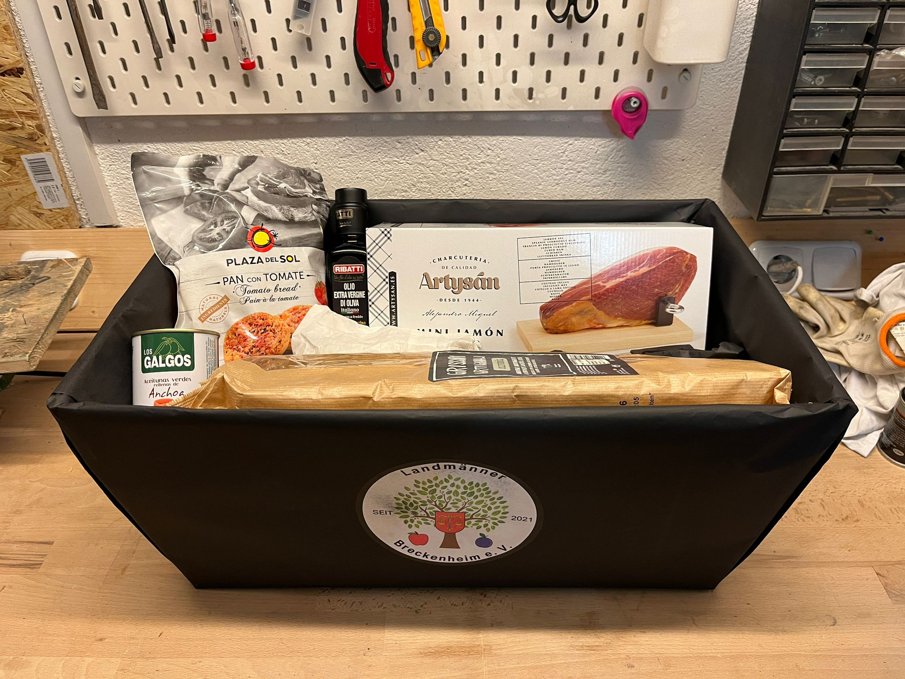

Unser 8. Dart Turnier fand am 22.11 statt! 🎯🎯, wie immer beim [Bistro Pizzeria da Fabi](https://www.facebook.com/Verardifabrizio). Es war wieder ein sehr schöner Abend.

Den ersten Preis hat die Mannschaft Treffnix abgeräumt. 

<!--more-->

Ergebnisse Vorrunde
===================

Wir haben das Turnier in zwei Vorgruppen gespielt. Innerhalb der Vorgruppen haben zunächst alle gegen alle gespielt. Die Ergebnisse waren wie folgt:

Ergebnisse Vorrunde A
---------------------

1. Treffnix mit 4 Siegen (217 Restpunkte der besiegten Teams)
2. Jimmbimm mit 3 Siegen (129 Restpunkte der besiegten Teams)
3. Hofbier 1 mit 3 Siegen (69 Restpunkte der besiegten Teams)
4. Fox River Brewing 1 mit 2 Siegen (157 Restpunkte der besiegten Teams)
5. Team Bock mit 2 Siegen (102 Restpunkte der besiegten Teams)
6. Havana Club mit 1 Siegen (2 Restpunkte der besiegten Teams)

Ergebnisse Vorrunde B
---------------------

1. Fox River Brewing 2 mit 4 Siegen (131 Restpunkte der besiegten Teams)
2. Girlspower mit 4 Siegen (41 Restpunkte der besiegten Teams)
3. 3??? mit 3 Siegen (205 Restpunkte der besiegten Teams)
4. MiniOnes mit 2 Siegen (53 Restpunkte der besiegten Teams)
5. Imker mit 2 Siegen (28 Restpunkte der besiegten Teams)
6. Hofbier 2 mit 0 Siegen (0 Restpunkte der besiegten Teams)

Ergebnisse Hauptrunden
======================

Im Anschluss ging es in die Hauptrunden. Auch hier haben wir zwei getrennte Runden gespielt, wobei die Hauptrunde C besetzt war aus den Plätzen 1-3 der Vorrunde A und den Plätzen 4-6 der Vorrunde B und die Hauptrunde D umgedreht mit den Plätzen 4-6 der Vorrunde A und den Plätzen 1-3 der Vorrunde B. Mit der Vorrunde hat man sich also nur eine bessere Ausgangslage erspielt, auch wenn jeder in der Hauptrunde noch die Chance hat, vorne mitzuspielen, wie der Fall von *Havana Club* perfekt zeigt. 

Natürlich wollen wir euch natürlich noch die Ergebnisse zeigen:

Ergebnisse Hauptrunde C
-----------------------

1. Hofbier 1 mit 5 Siegen (180 Restpunkte der besiegten Teams)
2. Treffnix mit 4 Siegen (303 Restpunkte der besiegten Teams)
3. Imker mit 2 Siegen (64 Restpunkte der besiegten Teams)
4. Jimmbimm mit 2 Siegen (62 Restpunkte der besiegten Teams)
5. Hofbier 2 mit 2 Siegen (5 Restpunkte der besiegten Teams)
6. MiniOnes mit 0 Siegen (0 Restpunkte der besiegten Teams)

Ergebnisse Hauptrunde D
-----------------------

1. Havana Club mit 4 Siegen (455 Restpunkte der besiegten Teams)
2. Fox River Brewing 2 mit 3 Siegen (190 Restpunkte der besiegten Teams)
3. Fox River Brewing 1 mit 3 Siegen (116 Restpunkte der besiegten Teams)
4. 3??? mit 3 Siegen (48 Restpunkte der besiegten Teams)
5. Girlspower mit 2 Siegen (163 Restpunkte der besiegten Teams)
6. Team Bock mit 0 Siegen (0 Restpunkte der besiegten Teams)

Ergebnisse Finale
=================

In das Finale sind jeweils die beiden besten Mannschaften der Hauptgruppen eingezogen, in der Reihenfolge der Punkte. Am Finale teilgenommen haben somit Hofbier 1, Havana Club, Treffnix und Fox River Brewing 2. Entschieden hat das Finale dann Treffnix, die Fox River Brewing 2, Hofbier 1 und Havana Club hinter sich ließen.

Uns hat der Abend großen Spaß gemacht und wir bedanken uns bei allen, die teilgenommen haben. Den Modus werden wir wohl für die kommenden Dartturniere beibehalten.